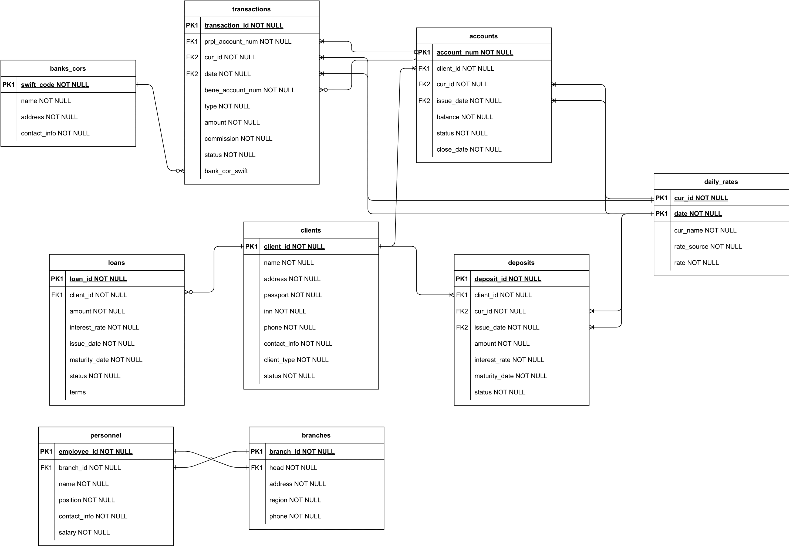

## 👨🏻‍💻 Финальное задание

Содержание:
1. [Описание предметной области](#задание_1)
2. [Преимущества для компании](#задание_2)
3. [Требования к данным и транзакциям](#задание_3)
4. [Проектирование БД](#задание_4)
5. [Реализация](#задание_5)
7. [Тестирование и типичные запросы](#задание_6)

<details>
<summary>🔽 Развернуть задание 🔽</summary>
Задание:

Спроектировать базу данных для выбранной предметной области.
</details>

Ответ:

## **Описание предметной области** <a name="задание_1"></a>
Я решил выбрать область **банковского дела**, поскольку я работаю стажером 
в одном из крупных российских банков, интересуюсь данной сферой, мировыми 
новостями и трендами в ней, а также планирую развиваться в области банкинга.
Для работы я взял вымышленный банк **«RuBank»** (название вдохновлено 
моей фамилией и названием России на английском языке).

Банк специализируется в области _банковских и финансовых услуг_, 
включая валютные обмены и переводы (в рублях и валюте), кредиты и 
депозиты. Основная цель банка — предоставление высококачественных 
финансовых услуг частным лицам, с перспективой расширения деятельности на 
сегмент корпоративного и инвестиционного банкинга (CIB).

На данный момент «RuBank» имеет около 3000 сотрудников, распределенных
по 20 филиалам по всей территории России. Банк имеет хотя бы одно отделение
в каждом Федеральном округе. В штате банка работают специалисты различных 
профилей: программисты, аналитики, менеджеры по работе с клиентами, 
продуктовые менеджеры и руководители команд.

Каждый филиал банка имеет уникальный номер и структуру, при этом 
большинство технического и управленческого персонала сосредоточено в
главном офисе в Москве, в то время как в регионах большинство 
сотрудников составляют менеджеры, сосредоточенные на прямом обслуживании 
и отвечающие за повседневную работу отделений. Технические специалисты, 
аналитики и продуктовые менеджеры занимаются конкретными аспектами 
банковской работы, включая обработку транзакций, анализ данных, 
развитие банковских продуктов, а также расширение бизнеса и выход на новые рынки.

Банк обслуживает около 5 миллионов клиентов, предоставляя им доступ к 
различным банковским продуктам и услугам через мобильное приложение 
и онлайн-банкинг. Клиенты могут осуществлять быстрый обмен валюты онлайн, 
совершать переводы (в рублях и валюте), брать кредиты и открывать 
депозиты в банке. «RuBank» также имеет широкую сеть банков-корреспондентов 
в мире, из-за чего считается одним из лидеров на рынке валютных 
переводов за границу в РФ.

Процесс работы банка «RuBank» и _«путь клиента»_ в этом банке можно 
описать следующим образом:
* Стать клиентом банка может гражданин любой страны. 
  Для этого ему необходимо прийти в любой из филиалов банка «RuBank»
  в России, чтобы открыть счет — обязательно рублевый и, опционально, 
  валютный (это также можно сделать позднее в приложении или онлайн-банке). 
* В отделении клиенту необходимо предоставить удостоверение личности и 
  заполнить соответствующие формы. Сотрудники банка помогут в выборе 
  подходящих банковских продуктов и услуг.
* Также гражданам РФ доступна удобная онлайн-авторизация через портал 
  Госуслуг без посещения офиса банка. Это позволяет клиенту открыть 
  счет в банке и получить доступ к онлайн-банкингу без необходимости 
  посещения отделения. Для этого потребуется войти на портал Госуслуг, 
  подтвердить личность и следовать инструкциям для регистрации в банке.

Клиенты могут использовать следующие **продукты** в банке:  
* **Валютные операции**: включают валютный обмен и переводы, позволяя
  клиентам обменивать валюту по выгодным курсам онлайн или в 
  отделении банка и отправлять денежные переводы как внутри страны, 
  так и за рубеж.
* **Кредитование**: предложение различных видов кредитов, включая 
  потребительские кредиты, ипотеку, автокредиты и нецелевые кредиты.
* **Депозиты**: предложение различных вариантов вкладов с разными 
  условиями и процентными ставками для сбережений клиентов.
* **Онлайн-банкинг**: предоставление клиентам возможности управлять 
  своими счетами, проводить платежи и переводы, а также следить 
  за своими финансами через интернет.

Для того, чтобы начать пользоваться любой из представленных услуг, 
клиенту необходимо открыть счет в рублях (или в валюте для валютных 
операций), а также пройти необходимые проверки службой безопасности 
и управления рисками для того, чтобы установить доступный лимит на 
различные операции.

После одобрения заявки клиент начинает пользоваться выбранными 
услугами. Это может включать управление счетом через онлайн-банкинг, 
использование кредитных средств, внесение средств на депозит 
и т.д. В случае возникновения вопросов или проблем клиент 
может обратиться за поддержкой в службу поддержки клиентов, 
которая доступна как в отделениях банка, так и онлайн.

Таким образом, «RuBank» предлагает своим клиентам полный спектр 
банковских услуг, начиная от процесса открытия счета и заканчивая 
различными финансовыми операциями, с возможностью выбора 
удобного способа обращения и взаимодействия с банком. 
Кроме того, банк стремится к максимальной цифровизации, 
отказываясь от многих рутинных процессов личного взаимодействия 
с клиентом, а также к открытию новых рынков работы. 

В 2024 г. банк рассчитывает начать работу с юридическими лицами.

## **Преимущества для компании** <a name="задание_2"></a>

### Миссия проекта создания базы данных для «RuBank»

Создание высокоэффективной, безопасной и масштабируемой базы 
данных для «RuBank» поможет улучшить качество и скорость обслуживания 
клиентов, оптимизировать внутренние процессы, включая отчетность 
для внутренних и внешних агентов, и поддержать стратегический 
рост банка в области банковских и финансовых услуг.

### Цели создания базы данных для «RuBank»
К **целям** создания базы данных относится:
1. Централизация и структурирование больших объемов данных о 
   клиентах, транзакциях, финансовых продуктах и операциях банка.
2. Улучшение доступа к данным и их анализа для повышения 
   эффективности принятия решений на основе данных.
3. Автоматизация банковских процессов и упрощение управления 
   клиентскими счетами, предоставления отчетности для регуляторов.

Создание базы данных поможет **решить следующие проблемы** компании:
1. Ускорить банковские операции и уменьшить время на их обработку.
2. Снизить риск ошибок и повысить точность данных за счет 
   автоматизации и стандартизации процессов.
3. Повысить безопасность хранения и обработки данных.

Также это поможет **улучшить следующие процессы** внутри и снаружи компании:
1. _Внутренние процессы_:
   - Оптимизация рабочего процесса сотрудников, включая быстрый 
   доступ к необходимой информации, ad-hoc аналитику и автоматизацию 
   рутинных задач, включая получение аналитических отчетов руководством 
   банка по определенному расписанию. 
   - Улучшение внутренней коммуникации и сотрудничества между различными 
   отделами по стране. 
   - Усиление контроля за финансовыми операциями и управлением рисками.
2. _Внешние процессы_:
   - Повышение уровня удовлетворенности клиентов за счет более быстрой 
   и качественной обработки их запросов и операций. 
   - Улучшение взаимодействия с банками-корреспондентами и другими 
   внешними партнерами засчет ускорения процесса обмена информацией. 
   - Поддержка стратегии расширения и цифровизации банка, включая 
   вход в новые сегменты рынка (работа с юридическими лицами) и 
   предложение новых продуктов.

## **Требования к данным и транзакциям** <a name="задание_3"></a>

### Технические требования базы данных для «RuBank»

Перечислим требования к данным, исходящие от различных
агентов, использующих и/или дающих данные из/в банк(а):

_Отделения_

В региональных отделениях в основном работают клиентские менеджеры, 
кредитные эксперты и сотрудники службы поддержки, которые делятся 
между собой в зависимости от уровня клиентов: обычный и премиальный, 
а в будущем после начала работы с юр. лицами также добавится разбивка 
на сегменты (малый, средний, крупный бизнес).

С каждым отделением связан уникальный номер отделения, адрес, 
общая контактная информация, информация о персонале: ФИО, 
сегмент работы, должность, дата вступления менеджера в должность.

Отделения напрямую работают с клиентами, поэтому они вводят, 
модифицируют и удаляют клиентские данные, анализируют клиентов, 
их транзакции, заявки на кредиты и депозиты, используют ежедневные 
данные об операциях для ответов на вопросы клиентов.

В каждом отделении важно поддерживать быстрый доступ к информации 
о счетах клиентов, возможность проведения и отслеживания транзакций 
в реальном времени, точность данных, а также иметь доступ к истории 
взаимодействия клиентов с банком.

_Персонал_

Разные роли, исполняемые сотрудниками, имеют различные требования 
к данным, а также соответствующий уровень доступа.

Так, **аналитики** используют все имеющиеся клиентские данные 
для поиска потенциальных клиентов, которые, к примеру, активно 
обменивают валюту, но не имеют кредит. Аналитики также строят модели 
машинного обучения на основе данных о платежах для поиска мошеннических 
операций. Кроме того, аналитики подготавливают различные отчеты 
для руководства (отчеты о прибыльности продуктов банка, 
утилизации установленных лимитов, возвращаемости кредитов), 
для которых используют все виды данных, которые есть в банке о клиентах 
и их взаимодействии с банком. Важно, чтобы некоторые из этих данных 
поступали в реальном времени, к примеру, для определения незаконных 
операций, а другие (например, по активам банка) могут быть актуальности уровня Т-1,
т.е. с задержкой на день.

**Клиентским менеджерам и сотрудникам службы поддержки** необходимо
видеть данные о транзакциях своих клиентов (в т.ч. историческим), 
либо получать их по запросу к аналитику/компетентному лицу, чтобы 
иметь возможность ответить на вопросы клиентов о статусе операций, 
а также одобрить клиенту кредитный лимит на определенную сумму. 
Сами менеджеры могут вводить и модифицировать личные данные клиентов, 
в том числе при первой встрече и идентификации новых клиентов. 
Также для них важно получать актуальную информацию о предлагаемых 
продуктах и услугах (ставки по кредитам и депозитам, курсы валют и т.д.).

**Продуктовые менеджеры**, определяющие стратегии развития 
банковских продуктов, на основе данных от аналитиков по 
экономической эффективности определяют ключевые показатели, 
связанные с выдаваемыми продуктами и, к примеру, корректируют 
ставки, по которым выдаются продукты, а также маржу, 
которую банк получает от них. 
Для этого им важно иметь возможность вносить эти данные в систему, 
чтобы затем клиентские менеджеры имели их для корректного взаимодействия с клиентами.

Для каждой из ролей сотрудников важно разграничивать уровень доступа 
к данным в соответствии с должностью для сохранения банковской тайны. 
Кроме того, для целей аналитики и соблюдения требований государственных 
регуляторов и законодательство в области деятельности банков, 
важно хранить все данные о клиентах и их действиях не менее 5 лет, 
даже после закрытия ими счетов.

_Клиенты_

Клиенты ежедневно совершают тысячи операций, включая переводы 
внутри России и за границу, обмен валют, пополняют депозиты и 
снимают с них деньги, пользуются кредитами и возвращают их банку. 
Для клиентов важно иметь доступ к истории своих действий в банке 
для разных целей: от анализа собственных трат до выгрузки отчета 
о движении средств на счете для органов власти и посольств. Важно, 
чтобы клиенты имели быстрый доступ к этим данным через приложение 
и интернет-банк. Также банк обязан хранить персональные данные о 
клиентах не менее 5 лет и защищать их должным образом, в соответствии с 
действующим законодательством в области персональных данных, в том 
числе обеспечивая банковскую тайну.

_Государственные органы и регуляторы_

**Государственные органы и регуляторы** (Центральный Банк России, 
ФНС, Росфинмониторинг) имеют право 
затребовать некоторые данные о действиях клиентов, а также отчеты о 
финансовой деятельности банка для соблюдения нормативных актов в 
области противодействия легализации (отмыванию) доходов, полученных 
преступным путем, финансированию терроризма и финансирования 
распространения оружия массового уничтожения (ПОД/ФТ/ФРОМУ). 

Также **иностранные регуляторы**, отвечающие за эмиссию и распространение 
валют, которыми пользуется банк, могут затребовать похожие данные. 
К последним относятся Европейский центральный банк (ЕЦБ), 
Федеральная резервная система (ФРС) США и др.

Для них критически важны требования к данным: их соответствие 
законодательству, полнота и точность отчетности, возможность 
аудита запрашиваемых данных. Иначе банк несет **большие риски**, 
связанные со штрафами и отзывом лицензии.

_Другие банки_

Банки-корреспонденты — как внутри России, так и за ее пределами — могут 
затребовать данные о клиентах и их счетах для проведения переводов через них 
(чаще всего валютных). 

Примером таких данных может выступать источник средств, цель платежа, 
информация о межбанковских операциях и др. Необходимо обеспечивать 
безопасность в передаче данных, точность информации о транзакциях и 
соблюдение международных стандартов взаимодействия между банками, 
чтобы клиенты не испытывали проблем с долгим ожиданием или отказом в 
переводах из-за некорректно переданной информации третьим банкам, 
осуществляющим перевод.

Чаще всего валютные переводы (особенно в евро, долларах США и фунтах стерлингов) 
проходят через третьи банки-корреспонденты, которые могут брать 
дополнительную комиссию за это. Поэтому другие банки (особенно иностранные) 
предоставляют «RuBank» информацию о комиссии, которую они берут сверх 
операции за осуществление переводов через них. Важно поддерживать эту 
информацию в актуальном состоянии, чтобы клиенты знали точную сумму комиссии за переводы. 

---

### Требования к транзакциям

Ниже перечислены примеры операций и транзакций, исполнение которых ожидается от
проектируемой базы данных:

**Ввод данных**
* Ввести данные о новом клиенте в базу данных 
* Ввести данные об открытии нового валютного счета в фунтах стерлингов у клиента 
* Ввести данные об установленном кредитном лимите для клиента

**Обновление/удаление данных**
* Обновить/удалить информацию о контактных данных клиента и его поручителя 
* Обновить сумму доступного лимита клиента после снятия средств 
* Обновить доступную сумму на счете двух клиентов, совершивших между собой перевод 
  со счета в рублях на счет в евро с конвертацией по курсу банка
* Обновление статуса SWIFT-перевода клиента банка в Германию за оплату аренды жилья в евро  

**Запросы к данным**
* _Транзакция 1._ Посчитать остаток по всем счетам клиента, включая кредитный лимит, 
  с переводом валютных счетов в рубли по курсу ЦБ на текущую дату
* _Транзакция 2._ Составить список движения средств (транзакций) по всем счетам 
  клиента за последние 6 месяцев в специальной форме для иностранного посольства 
* _Транзакция 3._ Сформировать отчет о пассивах и активах банка за 4 квартал 2023 г. 
  для Центрального Банка России 
* _Транзакция 4._ Сформировать отчет о топ-10 клиентах по полученному банком 
  доходу за 2023 г. для руководства в целях аналитики 
* _Транзакция 5._ Сформировать отчет о клиентах, получивших кредитный лимит за 
  последние 3 месяца, но не реализовавшим его (т.е. без операций по этому счету) для клиентских менеджеров для «проработки» клиента 
* _Транзакция 6._ Сформировать поквартальные отчеты о средней ставке по выдаваемым 
  кредитам и комиссиям за переводы и соответствующим им процентном (от кредитов) 
  и транзакционном (за комиссии от операций) доходах для руководства в целях 
  аналитики, т.е. посмотреть как менялись ставки и доходы банка 
* _Транзакция 7._ Определить топ-3 продукта банка по полученному доходу за 2023 г. 
* _Транзакция 8._ Выявить переводы клиентов за сегодняшний день, которые на 1000% 
  превосходят сумму их среднего перевода

### Частые операции и распределение нагрузки

_Системная спецификация для приложения базы данных_

Начальный размер базы данных:
* Сотрудники: в банке работают примерно 3000 сотрудников, распределенных по 
  20 отделениям. Из них около 2000 человек заняты в главном офисе в Москве,
  а в каждом из региональных отделений работает в среднем по 50 человек. 
* Клиентская база: активная клиентская база насчитывает около 5 миллионов человек. 
  Из них 100% имеют рублевые счета (это обязательный продукт для всех клиентов), 
  60% обладают хотя бы одним валютным счетом, 20% имеют депозиты в рублях, и 
  приблизительно 7% имеют активный кредитный лимит 
* Неактивные клиенты: в базе также должны находиться данные о 3 миллионах 
  неактивных клиентов, закрывших свои счета, информацию о которых необходимо 
  сохранять согласно законодательным требованиям

Темп роста базы данных
* Новые клиенты: ежемесячно к базе данных добавляется около 50 тысяч новых клиентов. 
  При этом, примерно 3 тысячи клиентов переходят в статус неактивных, но данные 
  о них продолжают храниться в базе. 
* Удаление данных: удаления записей из базы данных происходят редко, что 
  обусловлено законодательными требованиями о сохранении информации. 
* Новые продукты: в 2024 г. «RuBank» планирует добавить к предлагаемым банком 
  продуктам страхование. Для этого будет необходимо усовершенствовать БД. 
* Работа с юридическими лицами: в 2024 году «RuBank» планирует начать 
  обслуживание юридических лиц. Для этого предполагается дополнить создаваемую 
  на текущем этапе базы данных, копированием и небольшой доработкой схемы для 
  физических лиц. К концу 2024 года ожидается достижение числа активных 
  корпоративных клиентов в размере 10 тысяч фирм, включая 2000 групп компаний и 
  8000 их дочерних, либо standalone фирм (не входящих в группу). Прогнозируется, 
  что из этих корпоративных клиентов около 50% будут пользоваться кредитными 
  продуктами, а до 70% - валютными переводами. Однако для юридических лиц будет 
  доступен ряд банковских услуг, недоступных для физических лиц — например, 
  инкассация и факторинг.  

### Типы информационного поиска и их распределение по частоте использования

В банке «RuBank» наблюдается неравномерное распределение нагрузки на 
информационные поисковые системы. Основные пики активности пользователей 
приходятся на следующие временные интервалы:
* Утренний и дневной пик: самый высокий уровень активности фиксируется с 
  11:00 до 12:00 и с 15:00 до 17:00 по московскому времени. Эти часы соответствуют 
  активному рабочему времени в столичном регионе, где сосредоточено большинство 
  клиентов и основной офис банка. 
* Ночной пик: важной особенностью является увеличение активности в интервале 
  с 02:00 до 04:00 по МСК. Этот пик связан с автоматическими операциями по 
  оплате подписок и покупкам в онлайн-сервисах, которые обычно происходят в ночное время. 
* Пик мошеннических операций: в указанный выше ночной промежуток увеличивается 
  и число потенциально мошеннических операций. Это требует особого внимания и 
  повышенных мер безопасности.
* Региональные особенности: несмотря на то, что в более восточных регионах 
  России также происходят операции в аналогичное местное время, нагрузка от 
  этих регионов значительно меньше по сравнению с Москвой. Это обусловлено 
  меньшим числом клиентов и меньшей активностью в этих регионах.

### Требования к работе в сети и совместному доступу 
* Единая база данных: все отделения банка должны быть интегрированы с единой 
  централизованной базой данных. Это позволяет сотрудникам вносить изменения 
  (согласно уровню доступа и роли) и извлекать актуальную информацию в режиме 
  реального времени. 
* Быстродействие операций: операции, связанные с взаимодействием клиентов и 
  банка/клиентских менеджеров, должны обрабатываться с максимальной скоростью. 
  Такие операции, как транзакции по счетам и проверка данных клиентов, должны 
  занимать от 1 до 3 секунд. Выгрузка информации о транзакциях за последние 6 
  месяцев должна выполняться не более чем за 1 минуту. Расчет остатков по всем 
  счетам клиента при входе в мобильное приложение или онлайн-банк должен 
  занимать не более 1 секунды. При этом эти операции зачастую будут происходить
  одновременно.
* Обработка критически важных транзакций: транзакции, связанные с передачей 
  данных банкам-корреспондентам и финансовым регуляторам, имеют особую важность. 
  Задержка или сбой в их обработке могут привести к серьезным финансовым и 
  юридическим последствиям. Максимальное время ответа на запросы от 
  банков-корреспондентов установлено в 30 минут, а для финансовых регуляторов — 1 
  рабочий день, при условии дополнительной проверки данных компетентными 
  сотрудниками банка, т.е. сами данные должны быть получены в течение 1 часа для 
  возможности дальнейшей корректировки при выявлении ошибок.

### Защита и конфиденциальность данных
* База данных банка должна быть надежно защищена с использованием паролей и 
  иерархии уровней доступа, конфиденциальность данных подлежит пристальному 
  контролю.
* Максимальный доступ к данным предоставляется исключительно представителям 
  службы безопасности банка, задачей которых является выявление и предотвращение 
  мошеннических операций. Для сотрудников других подразделений предусмотрены 
  более ограниченные права доступа к конфиденциальным данным, позволяющие 
  просматривать обобщенную 
  информацию или получать данные по специальным запросам с обоснованием 
  необходимости доступа.

### Копирование и восстановление, Юридические вопросы
* Хранение данных: согласно законодательству, информация о клиентах должна 
  храниться в течение не менее пяти лет после того, как они перестают быть 
  клиентами банка. Это обеспечивает соответствие нормативным требованиям 
  и позволяет банку отвечать на запросы регуляторов и проводить аудиты. 
* Резервное копирование: для обеспечения надежности и доступности данных, 
  необходимо осуществлять их регулярное резервное копирование. Общие данные
  банка должны копироваться дважды в день — в начале и в конце рабочего дня. 
  Данные по операциям следует копировать каждый час в течение рабочего дня 
  для минимизации потерь в случае системных сбоев. 
* Все данные, связанные с клиентами, необходимо хранить не менее 5 лет 
  даже если они перестают быть клиентами банка — это требование законодательства. 
  Общие данные необходимо копировать дважды в день — в начале и конце 
  рабочего дня, а данные по операциям — каждый час в течение рабочего дня. 
* Возможны дополнительные юридические требования, специфичные для банковской 
  деятельности. Для их определения необходимо провести интервью с 
  юридическим отделом банка.

---

## **Проектирование БД** <a name="задание_4"></a>

Для проектирования базы данных я выбрал **нисходящий подход** (_top-down_),
поскольку мне кажется, что для моей предметной области первично
выделение различных сущностей и связей между ними, отталкиваясь от
требования бизнеса и пользователей.

### Концептуальное проектирование

Составим концептуальную схема базы данных.

Для создания концептуальной схемы базы данных банка "RuBank", 
используя нисходящий подход, важно определить ключевые сущности, 
их атрибуты и отношения. 

Проанализировав требования пользователей, я выделил следующие
основные сущности:

1. **Клиенты**:
* Атрибуты: 
  * Идентификатор клиента, 
  * имя, 
  * персональные данные (паспорт, ИНН)
  * контактная информация, 
  * адрес, 
  * тип клиента (частное лицо/юридическое лицо); пока что все клиенты будут
  физическими лицами, данный атрибут нужен для единства формата в 
  будущем, т.к. банк планирует начать работу и с юр. лицами тоже,
  * статус клиента (активный / нет)
* Отношения: Связаны со счетами, кредитами и депозитами.
     
2. **Счета**:
* Атрибуты: 
  * Номер счета, 
  * идентификатор клиента,
  * идентификатор валюты счета,
  * дата открытия,
  * баланс, 
  * статус счета, 
  * дата закрытия.
* Отношения: 
  * Принадлежат клиентам, 
  * связаны с транзакциями и курсами валют.
    
3. **Транзакции**:
* Атрибуты: 
  * Идентификатор транзакции,
  * номер счета принципала (отправителя),
  * идентификатор валюты транзакции,
  * дата и время платежа,
  * номер счета бенефициара (получателя),
  * тип (перевод, платеж, вклад, снятие), 
  * сумма, 
  * комиссия (в рублях), 
  * статус,
  * SWIFT-код банка-корреспондента.
* Отношения: 
  * Связаны со счетами, банками-корреспондентами, курсами валют
  * Принципал (отправитель) обязательно является клиентом банка,
  бенефициар (получатель) -- не обязательно.

4. **Кредиты**:
* Атрибуты: 
  * Идентификатор кредита, 
  * Идентификатор клиента,
  * сумма,
  * годовая ставка,
  * дата открытия,
  * дата истечения,
  * статус,
  * условия.
* Отношения: 
  * Связаны с клиентами.

5. **Депозиты**
* Атрибуты: 
  * Идентификатор депозита, 
  * идентификатор валюты депозита,
  * дата открытия,
  * сумма,
  * годовая ставка,
  * дата истечения,
  * статус.
* Отношения: 
  * Принадлежат клиентам, 
  * связаны с курсами валют.

6. **Сотрудники**:
* Атрибуты: 
  * Идентификатор сотрудника, 
  * идентификатор отделения,
  * имя, 
  * должность,
  * контактная информация,
  * оклад.
* Отношения: 
  * Работают в отделениях.

7. **Отделения**:
* Атрибуты: 
  * Идентификатор отделения, 
  * руководитель,
  * адрес, 
  * телефон, 
  * регион.
* Отношения: 
  * Содержат сотрудников, 
  * у каждого отделения есть один руководитель.

8. **Банки-корреспонденты**:
* Атрибуты: 
  * Идентификатор банка (SWIFT-код), 
  * название,
  * адрес,
  * контактная информация.
* Отношения: 
  * Связаны с транзакциями международных переводов (обязательно)
    и внутренних переводов (необязательно).

9. **Курсы валют**:
* Атрибуты:
  * Идентификатор валюты
  * дата курса
  * название валюты
  * источник курса (ЦБ, Московская биржа, курс банка)
  * стоимость 1 единицы валюты в рублях.

Эта концептуальная схема обеспечивает основу для дальнейшей 
разработки логической и физической моделей базы данных. 

Она позволит организовать информацию о клиентах, счетах, 
транзакциях и взаимодействиях сотрудников таким образом, 
чтобы поддерживать эффективную и безопасную банковскую 
операционную деятельность.

Однако данная модель имеет ряд ограничений. Важно отметить, что
она в целом является сильным упрощением процессов и принципов 
организации и хранения данных в реальном банке, поскольку, во-первых,
данная сфера сильно зарегулирована с правовой т.з. и, во-вторых,
позволить собственные технологические решения могут только очень крупные 
банки. Большинство банков на рынке обычно пользуется вендорским ПО, 
приобретаемым по лицензии, которое соответствует всем мировым стандартам, 
поскольку это выгоднее, чем создавать и поддерживать собственную архитектуру,
включая свою базу данных.

Если говорить конкретнее, главными ограничениями являются следующие:
- считается, что кредиты выдаются только в рублях
- для простоты не учитывается, что сотрудники тоже могут быть клиентами банка
- в таблице с курсами валют будет находиться только курс Центрального банка России, 
и это сильное упрощение работы валютного рынка. В реальности нужно было бы еще хранить
курс биржи (скорее всего, Московской (MOEX), на которой банк сам закупает валюту, 
а также курс банка, по которому он продает валюту клиентам и по которым производит 
операции. Более того, для разных клиентов могут быть разные ставки в зависимости
от индивидуальных условий и т.д. Кроме того, курс ЦБ обновляется только в будние дни,
я также отойду от этого принципа в пользу простоты генерации синтетических данных.

### Модель данных «сущность–связь» (ER-model)

Ниже представлена **ER-модель** данных, созданная на основе описанных выше 
сущностей и связей между ними.

Файл с ней также доступен в репозитории в двух форматах:
- [er-rubank.png](./er-rubank.png)
- [er-rubank.pdf](./er-rubank.pdf)



Описание модели с комментариями:

1. Клиенты (clients).
Атрибуты:
   * client_id (PK), 
   * name, 
   * address,
   * passport,
   * inn,
   * phone,
   * contact_info,
   * client_type (на текущий момент везде физ. лица),
   * status.

Связи: Каждый клиент может иметь несколько счетов. 
Может быть связан с несколькими транзакциями через счета, 
иметь несколько кредитов и депозитов.

2. Счета (accounts).
Атрибуты: 
   * account_num (PK), 
   * client_id (FK),
   * cur_id (составной FK с issue_date),
   * issue_date (составной FK с cur_id),
   * balance, 
   * status (активный клиент или нет),
   * close_date (может быть null, если клиент активный).

Связи: Принадлежат клиенту. Связаны с транзакциями (могут быть 
транзакции самому себе, тогда счет принципала и бенефициара
будут совпадать). Также связаны с курсами валют.

3. Транзакции (transactions).
Атрибуты: 
   * transaction_id (PK), 
   * prpl_account_num (FK),
   * cur_id (составной FK с date),
   * date (составной FK с cur_id),
   * bene_account_num,
   * type (внутренняя / международная),
   * amount, 
   * commission,
   * status,
   * bank_cor_swift (обязательно для межд. транзакций,
   не обяз. для внутр).

Связи: связаны со счетами. При этом принципал обязательно является
клиентом банка и имеет счет, а бенефициар -- не обязательно. 
Также международные транзакции связаны с банками-корреспондентами
(т.к. производятся через них).

4. Кредиты (loans).
Атрибуты: 
   * loan_id (PK), 
   * client_id (FK), 
   * amount, 
   * interest_rate,
   * issue_date,
   * maturity_date,
   * status,
   * terms.

Связи: Выданы клиентам.

5. Депозиты (deposits).
Атрибуты: 
   * deposit_id (PK), 
   * client_id (FK), 
   * cur_id (FK вместе с issue_date),
   * issue_date (FK вместе с cur_id),
   * amount,
   * maturity_date,
   * status.
   
Связи: Принадлежат клиентам и связаны с курсами валют.

6. Сотрудники (personnel).
Атрибуты: 
   * employee_id (PK), 
   * branch_id (FK),
   * name, 
   * position,
   * contact_info,
   * salary
   
Связи: Работают в отделениях. Один сотрудник является руководителем одного
из отделений.

7. Отделения (branches).
Атрибуты: 
   * branch_id (PK), 
   * head (FK),
   * address, 
   * region,
   * phone.
   
Связи: содержат сотрудников, один из которых является руководителем.

8. Банки-корреспонденты (banks_cors).
Атрибуты: 
   * swift_code (PK), 
   * name, 
   * address, 
   * contact_info.
   
Связи: Участвуют в международных транзакциях.

9. Курсы валют (daily_rates)
Атрибуты: 
   * cur_id (составной PK с day),
   * day (составной PK с cur_id),
   * cur_name,
   * rate_source (в текущей реализации только ЦБ РФ),
   * rate.

Связи: связаны со всеми сущностями, в которых есть различные валюты,
отличные от российского рубля.

Эта ER-модель учитывает ключевые аспекты работы банка, включая управление клиентскими счетами, 
транзакциями, кредитными и депозитными продуктами, а также взаимодействие сотрудников и 
отделений. Она обеспечивает структурированную основу для дальнейшего детализированного 
проектирования и реализации базы данных.

---

### Логическое проектирование

На этапе логического проектирования базы данных для банка "RuBank", 
я переведу концептуальную **ER-модель** в структурированную **логическую схему**, 
которая определяет таблицы, их поля (атрибуты) и взаимосвязи между ними. 

Этот этап включит в себя определение структуры данных, ключей и ограничений 
целостности для каждой таблицы.

#### Таблицы и их атрибуты

_Клиенты (clients):_
* client_id (INT, PK)
* name (TEXT)
* address (TEXT)
* passport (VARCHAR)
* inn (VARCHAR)
* phone (TEXT)
* contact_info (JSONB)
* client_type (TEXT)
* status (TEXT)

_Счета (accounts):_
* account_num (VARCHAR, PK)
* client_id (INT, FK - clients.client_id)
* cur_id (SMALLINT, FK - daily_rates.cur_id)
* issue_date (DATE, FK - daily_rates.day)
* balance (DECIMAL)
* status (TEXT)
* close_date (DATE)

_Транзакции (transactions):_
* transaction_id (INT, PK)
* prpl_account_num (VARCHAR, FK - accounts.account_num)
* cur_id (SMALLINT, FK - daily_rates.cur_id)
* date (DATE, FK - daily_rates.day)
* bene_account_num (VARCHAR)
* type (TEXT)
* amount (DECIMAL)
* commission (DECIMAL)
* status (TEXT)
* bank_cor_swift (VARCHAR, FK - banks_cors.swift_code)

_Кредиты (loans):_
* loan_id (INT, PK)
* client_id (INT, FK - clients.client_id)
* amount (DECIMAL)
* interest_rate (DECIMAL)
* issue_date (DATE)
* maturity_date (DATE)
* status (TEXT)
* terms (TEXT)

_Депозиты (deposits):_
* deposit_id (INT, PK)
* client_id (INT, FK - clients.client_id)
* cur_id (SMALLINT, FK - daily_rates.cur_id)
* issue_date (DATE, FK - daily_rates.day)
* amount (DECIMAL)
* maturity_date (DATE)
* status (TEXT)

_Сотрудники (personnel):_
* employee_id (INT, PK)
* branch_id (SMALLINT, FK - branches.branch_id)
* name (TEXT)
* position (TEXT)
* contact_info (JSONB)
* salary (DECIMAL)

_Отделения (branches):_
* branch_id (SMALLINT, PK)
* head (SMALLINT, FK - personnel.employee_id)
* address (TEXT)
* region (TEXT)
* phone (VARCHAR)

_Банки-корреспонденты (banks_cors):_
* swift_code (VARCHAR, PK)
* name (VARCHAR)
* address (VARCHAR)
* contact_info (JSONB)

_Курсы валют (daily_rates):_
* cur_id (SMALLINT, PK, FK - accounts.cur_id, deposits.cur_id, transactions.cur_id)
* day (DATE, PK, FK - accounts.issue_date, deposits.issue_date, transactions.date)
* cur_name (VARCHAR)
* rate_source (VARCHAR)
* rate (DECIMAL)

#### Ограничения целостности данных

_Внешние ключи (Foreign Keys):_

В таблице Счета (accounts):
* client_id (FK) - ссылается на client_id в таблице Клиенты (clients).

В таблице Транзакции (transactions):
* prpl_account_num (FK) - ссылается на account_num в таблице Счета (accounts).
* cur_id (FK) - ссылается на cur_id в таблице Курсы валют (daily_rates).
* date (FK) - ссылается на day в таблице Курсы валют (daily_rates).
* bank_cor_swift (FK) - ссылается на swift_code в таблице Банки-корреспонденты (banks_cors).

В таблице Кредиты (loans):
* client_id (FK) - ссылается на client_id в таблице Клиенты (clients).

В таблице Депозиты (deposits):
* client_id (FK) - ссылается на client_id в таблице Клиенты (clients).
* cur_id (FK) - ссылается на cur_id в таблице Курсы валют (daily_rates).
* issue_date (FK) - ссылается на day в таблице Курсы валют (daily_rates).

В таблице Сотрудники (personnel):
* branch_id (FK) - ссылается на branch_id в таблице Отделения (branches).

В таблице Отделения (branches):
* head (FK) - ссылается на employee_id в таблице Сотрудники (personnel).

В таблице Курсы валют (daily_rates):
* cur_id (FK) - ссылается на cur_id в таблицах Счета (accounts), Депозиты (deposits) и Транзакции (transactions).
* day (FK) - ссылается на issue_date в таблицах Счета (accounts) и Депозиты (deposits), а также на date в таблице Транзакции (transactions).

Эти внешние ключи играют критическую роль в обеспечении целостности 
данных, позволяя связывать записи в различных таблицах и обеспечивать 
их согласованность.

#### Ограничения целостности данных

Для обеспечения целостности данных в моей БД банка "RuBank"
могут быть использованы следующие ограничения (не исчерпывающий список):

1. Клиенты (clients):
   * client_id INT PRIMARY KEY: Уникальный идентификатор каждого клиента.
   * passport VARCHAR UNIQUE NOT NULL: Уникальный номер паспорта для каждого клиента.
   * inn VARCHAR UNIQUE NOT NULL: Уникальный налоговый номер (ИНН) для каждого клиента.
   * status TEXT NOT NULL CHECK (status IN ('действующий', 'закрыт')): Ограничение 
   на допустимые значения статуса.
2. Счета (accounts):
   * account_num VARCHAR PRIMARY KEY: Уникальный номер каждого счета в соответствии
   с международным стандартом IBAN (ISO 13616).
   * client_id INT NOT NULL REFERENCES clients (client_id): Внешний ключ, 
   ссылающийся на клиентов.
   * balance DECIMAL NOT NULL CHECK (balance >= 0): Баланс счета не может быть отрицательным.
   * status TEXT NOT NULL CHECK (status IN ('активный', 'закрыт')): Ограничение 
   на допустимые значения статуса.
3. Транзакции (transactions):
   * transaction_id INT PRIMARY KEY: Уникальный идентификатор транзакции.
   * prpl_account_num VARCHAR REFERENCES accounts (account_num): Внешний ключ, 
   ссылающийся на счета.
   * amount DECIMAL CHECK (amount > 0): Сумма транзакции должна быть больше 0.
   * commission DECIMAL CHECK (amount >= 0): Сумма комиссии не может быть отрицательной.
4. Кредиты (loans):
   * loan_id INT PRIMARY KEY: Уникальный идентификатор каждого кредита.
   * client_id INT REFERENCES clients (client_id): Внешний ключ, ссылающийся на клиентов.
   * amount DECIMAL CHECK (amount > 0): Сумма кредита должна быть больше 0.
5. Депозиты (deposits):
   * deposit_id INT PRIMARY KEY: Уникальный идентификатор каждого депозита.
   * client_id INT REFERENCES clients (client_id): Внешний ключ, ссылающийся на клиентов.
   * amount DECIMAL CHECK (amount > 0): Сумма депозита должна быть больше 0.
6. Сотрудники (personnel):
   * employee_id INT PRIMARY KEY: Уникальный идентификатор каждого сотрудника.
   * branch_id SMALLINT REFERENCES branches (branch_id): Внешний ключ, ссылающийся на 
   отделение.
   * salary DECIMAL CHECK (salary > 0): Зарплата должна быть больше 0.
7. Отделения (branches):
   * branch_id SMALLINT PRIMARY KEY: Уникальный идентификатор каждого отделения.
   * head SMALLINT REFERENCES personnel (employee_id): Внешний ключ, ссылающийся 
   на руководителя отделения.
8. Банки-корреспонденты (banks_cors):
   * swift_code VARCHAR PRIMARY KEY: Уникальный SWIFT-код каждого банка-корреспондента.
9. Курсы валют (daily_rates):
   * cur_id SMALLINT, day DATE, PRIMARY KEY (cur_id, day): Составной первичный ключ.
   * rate DECIMAL CHECK (rate > 0): Курс должен быть больше 0.

#### Ограничения на уникальность (Unique Constraints): 

1. Клиенты (clients):
   * client_id: Уникальный идентификатор каждого клиента.
   * passport: Уникальный номер паспорта для каждого клиента.
   * inn: Уникальный налоговый номер (ИНН) для каждого клиента.
2. Счета (accounts):
   * account_num: Уникальный номер каждого счета.
3. Транзакции (transactions):
   * transaction_id: Уникальный идентификатор каждой транзакции.
4. Кредиты (loans):
   * loan_id: Уникальный идентификатор каждого кредита.
5. Депозиты (deposits):
   * deposit_id: Уникальный идентификатор каждого депозита.
6. Сотрудники (personnel):
   * employee_id: Уникальный идентификатор каждого сотрудника.
   * contact_info: Уникальный контакт (например, электронный адрес), 
   если требуется предотвратить дублирование контактных данных сотрудников.
7. Отделения (branches):
   * branch_id: Уникальный идентификатор каждого отделения.
   * phone: Уникальный номер телефона для каждого отделения, 
   предполагается, что у каждого отделения должен быть свой уникальный номер.
8. Банки-корреспонденты (banks_cors):
   * swift_code: Уникальный SWIFT-код каждого банка-корреспондента.
9. Курсы валют (daily_rates):
   * cur_id и day: Составной ключ, уникальный для каждой пары валюта-день.
   
Эти ограничения на уникальность обеспечивают, чтобы важные данные не 
дублировались в разных записях, что критически важно для поддержания 
целостности и надежности данных в банковской системе. 
Они также помогают предотвратить возможные ошибки ввода и облегчают поиск данных.
Кроме того, они должны быть основаны на бизнес-требованиях.

Эта логическая модель базы данных обеспечивает основу для последующего 
физического проектирования и реализации базы данных, учитывая специфические 
требования и процессы банковской деятельности.

### Оценка нормальных форм отношений

Оценка нормальных форм для каждой из таблиц зависит от схемы данных, 
функциональных зависимостей и бизнес-правил. 

Проанализируем каждую таблицу:

_Таблица `bank.clients`:_

* **Нормальная форма**: 3НФ (Третья нормальная форма).
* **Обоснование**: Каждый атрибут зависит только от первичного ключа (client_id), не существует транзитивных зависимостей, и все атрибуты являются неделимыми.

_Таблица `bank.accounts`:_

* **Нормальная форма**: 3НФ.
* **Обоснование**: Все атрибуты функционально зависят только от первичного ключа (account_num), нет транзитивных зависимостей.

_Таблица `bank.transactions`:_

* **Нормальная форма**: 3НФ.
* **Обоснование**: Все атрибуты функционально зависят только от первичного ключа (transaction_id), нет транзитивных зависимостей.

_Таблица `bank.loans`:_

* **Нормальная форма**: 3НФ.
* **Обоснование**: Все атрибуты зависят только от loan_id и нет транзитивных зависимостей.

_Таблица `bank.deposits`:_

* **Нормальная форма**: 3НФ.
* **Обоснование**: Все атрибуты зависят только от deposit_id, нет транзитивных или частичных зависимостей.

_Таблица `bank.personnel`:_

* **Нормальная форма**: 3НФ.
* **Обоснование**: Каждый атрибут зависит от employee_id, и нет транзитивных зависимостей.

_Таблица `bank.branches`:_

* **Нормальная форма**: 3НФ.
* **Обоснование**: Все атрибуты зависят только от branch_id, и нет транзитивных зависимостей.

_Таблица `bank.banks_cors`:_

* **Нормальная форма**: 3НФ.
* **Обоснование**: Все атрибуты зависят только от swift_code, и нет транзитивных зависимостей.

_Таблица `bank.daily_rates`:_

* **Нормальная форма**: 3НФ.
* **Обоснование**: Каждый атрибут зависит только от составного ключа (cur_id, date), и нет транзитивных зависимостей.

В каждой из этих таблиц атрибуты зависят только от их первичных ключей, и нет видимых признаков транзитивных зависимостей или дублирования данных, что соответствует требованиям 3НФ. Это обеспечивает эффективное хранение данных и минимизирует возможности для аномалий вставки, обновления и удаления.

## **Реализация БД (физическое проектирование)** <a name="задание_5"></a>

Код для формирования базы данных можно посмотреть в репозитории по ссылке в двух местах:
* [rubank_db.sql](./rubank_db.sql)
* [final_project_backup.sql](./final_project_backup.sql)

Первый является рукописным мною, а второй — резервная копия БД, созданная с помощью утилиты `pg_dump`.
БД можно восстановить, запустив файл с помощью утилиты `psql` (под аккаунтом `postgres`):
```bash
psql -f rubank_db.sql
```
или
```bash
psql -f final_project_backup.sql
```

Синтетические данные для реализации БД были сгенерированы с помощью языка
`Python` с учетом реальных форматов и стандартов, используемых в банковской сфере
(с некоторыми упрощениями). Чаще всего для сэмплирования использовалось равномерное распределение.

Резервная копия была получена следующей командой:
```bash
pg_dump -U postgres -h localhost -p 5432 final_project > /home/postgres/final_project_backup.sql
```

Ниже я более подробно опишу триггеры, триггерные функции и хранимые функции (процедуры) 
на языке `PL/pgSQL`, которые также находятся в каждом из этих файлов. Также я приведу 
несколько примеров их использования.

---

### Триггеры и триггерные функции на `PL/pgSQL`

В своей БД я реализовал два примера триггеров и триггерных функций к ним на `PL/pgSQL`, 
которые могут быть полезными в контексте работы с реальной БД в области банковского дела.

1. **Автоматическое обновление статуса кредита**

Этот триггер автоматически изменит статус кредита на `просрочен` при попытке обновления, 
если текущая дата превышает дату погашения кредита, и он еще не закрыт.

Код триггера и триггерной функции (также доступен в файлах выше):
```SQL
-- Триггерная функция для обновления статуса кредита
CREATE OR REPLACE FUNCTION update_loan_status()
RETURNS TRIGGER AS $$
BEGIN
    IF NEW.maturity_date < CURRENT_DATE AND NEW.status != 'закрыт' THEN
        NEW.status := 'просрочен';
    END IF;
    RETURN NEW;
END;
$$ LANGUAGE plpgsql;

-- Триггер для обновления статуса кредита
CREATE TRIGGER check_loan_status
BEFORE UPDATE ON bank.loans
FOR EACH ROW
EXECUTE PROCEDURE update_loan_status();
```
В первом триггере используется триггерная функция `update_loan_status`, которая проверяет, 
не превысила ли текущая дата дату погашения кредита, и если это так, 
изменяет статус кредита на "просрочен".

Приведу пример их использования.
Будем работать с кредитом с `loan_id = 2`, статус которого: `активен`:
```SQL
final_project=# SELECT * FROM loans WHERE loan_id = 2 ;

 loan_id | client_id |    amount    | interest_rate | issue_date | maturity_date | status  | terms 
---------+-----------+--------------+---------------+------------+---------------+---------+-------
       2 |        25 | 3381231.7212 |     12.209392 | 2023-04-27 | 2023-10-03    | активен | 
(1 строка)
```
Видим, что дата его закрытия уже прошла, а сумма до сих пор не погашена.
Допустим, клиент внес деньги за кредит и сократил сумму кредита до 10 тысяч.
Попробуем отразить это в таблице:
```SQL
final_project=# 
UPDATE loans    
    SET amount = 10000.00::DECIMAL(20, 4)
WHERE loan_id = 2;

UPDATE 1

final_project=# SELECT * FROM loans WHERE loan_id = 2 ;
 loan_id | client_id |   amount   | interest_rate | issue_date | maturity_date |  status   | terms 
---------+-----------+------------+---------------+------------+---------------+-----------+-------
       2 |        25 | 10000.0000 |     12.209392 | 2023-04-27 | 2023-10-03    | просрочен | 
(1 строка)
```
Видим, что, хотя сумма кредита стала меньше, статус поменялся на `просрочен`, как
мы и хотели.

2. **Проверка баланса перед закрытием счета**

Этот триггер не позволит закрыть счет, если на нем есть остаток средств.
Код триггера и триггерной функции (также доступен в файлах выше):
```SQL
-- Триггерная функция для проверки баланса перед закрытием счета
CREATE OR REPLACE FUNCTION check_account_balance()
RETURNS TRIGGER AS $$
BEGIN
    IF OLD.status = 'открыт' AND NEW.status = 'закрыт' AND OLD.balance > 0 THEN
        RAISE EXCEPTION 'Невозможно закрыть счет с положительным балансом';
    END IF;
    RETURN NEW;
END;
$$ LANGUAGE plpgsql;

-- Триггер для проверки баланса перед закрытием счета
CREATE TRIGGER validate_account_closure
BEFORE UPDATE ON bank.accounts
FOR EACH ROW
EXECUTE PROCEDURE check_account_balance();
```
Здесь триггерная функция `check_account_balance` проверяет, не пытается 
ли пользователь закрыть счет, на котором еще есть деньги. Если на счету 
есть средства, триггер вызывает исключение, предотвращая закрытие счета.

Проверим его работу. Посмотрим на первые 5 счетов:
```SQL
SELECT * FROM accounts LIMIT 5 ;

            account_num            | client_id | cur_id | issue_date |   balance    | status | close_date 
-----------------------------------+-----------+--------+------------+--------------+--------+------------
 RU9983803436545906901757432591750 |        19 |    840 | 2023-10-16 |       0.0000 | закрыт | 2023-10-22
 RU1683803436596193217028081534610 |        83 |    356 | 2023-05-03 | 3982316.2495 | открыт | 
 RU2583803436511360000518303822185 |        94 |    356 | 2023-01-04 |       0.0000 | закрыт | 2023-06-08
 RU6783803436582018660242960957244 |        63 |    356 | 2023-11-02 | 3959272.1596 | открыт | 
 RU7383803436567535429961689788567 |        92 |    978 | 2023-09-30 |       0.0000 | закрыт | 2023-12-14
(5 строк)
```
Возьмем первый сверху открытый счет
```SQL
final_project=# 
UPDATE accounts                        
    SET status = 'закрыт'::TEXT,
        close_date = '2023-12-25'::DATE
WHERE account_num = 'RU1683803436596193217028081534610'::VARCHAR(34)
;
ОШИБКА:  Невозможно закрыть счет с положительным балансом
КОНТЕКСТ:  функция PL/pgSQL check_account_balance(), строка 4, оператор RAISE
```
Триггерная функция не дала нам закрыть счет с положительным балансом, как 
мы и хотели.

Оба триггера могут быть очень полезными в реальной банковской системе 
для автоматизации проверок и обеспечения соблюдения правил бизнес-процессов.

### Хранимые функции на `PL/pgSQL`

Также представлю две хранимых функции, написанных на языке `PL/pgSQL`.

1. **Расчет общего баланса клиента по всем счетам в рублях**

Эта функция будет рассчитывать и возвращать общую сумму баланса всех 
активных счетов, принадлежащих определенному клиенту, с пересчетом валюты в рубли. 
Эта операция производится
в большинстве банковских приложениях и онлайн-банках, когда мы заходим 
на главную страницу.

Поскольку в курсах валют в качестве последней доступной даты я добавил
25 декабря 2023 г., я вручную укажу эту дату в функции. Но, конечно, в реальной 
жизни можно автоматически подставлять туда сегодняшнюю дату.

Код функции (также доступен в файлах выше):
```SQL
-- Расчет общего баланса клиента по всем счетам
CREATE OR REPLACE FUNCTION calculate_total_balance_in_rubles(client_id_param INT)
RETURNS DECIMAL AS $$
DECLARE
    total_balance_rubles DECIMAL(20,4) := 0;
    account_balance DECIMAL(20,4);
    exchange_rate DECIMAL(20,6);
BEGIN
    FOR account_balance, exchange_rate IN
        SELECT a.balance, COALESCE(r.rate, 1)
        FROM bank.accounts a
        LEFT JOIN bank.daily_rates r ON a.cur_id = r.cur_id AND r.date = '2023-12-25'
        WHERE a.client_id = client_id_param AND a.status = 'открыт'
    LOOP
        total_balance_rubles := total_balance_rubles + (account_balance * exchange_rate);
    END LOOP;
    
    RETURN total_balance_rubles;
END;
$$ LANGUAGE plpgsql;
```
Проверим, как работает функция на примере клиента с `client_id = 49`:
```SQL
final_project=# SELECT calculate_total_balance_in_rubles(49) ;

 calculate_total_balance_in_rubles 
-----------------------------------
                      3028400.9702
(1 строка)
```
Посмотрим, похоже ли это на правду:
```SQL
final_project=# SELECT * FROM accounts WHERE client_id = 49 AND status = 'открыт' ;
            account_num            | client_id | cur_id | issue_date |   balance    | status | close_date 
-----------------------------------+-----------+--------+------------+--------------+--------+------------
 RU8583803436553386257766521949981 |        49 |    356 | 2023-03-07 | 3636872.7533 | открыт | 
 RU4483803436574648344464338946055 |        49 |    356 | 2023-06-01 | 3676957.1290 | открыт | 
(2 строки)
```
Код валюты 356 соответствует индийской рупии, поэтому, действительно, видим перевод в рубли.

2. **Расчет процентного дохода по депозитам на определенную дату**

Эта функция будет рассчитывать проценты по всем депозитам на 
указанную дату. Она может быть полезна для анализа прибыльности 
депозитных продуктов банка на конкретную дату.
Это может быть особенно полезно для финансового анализа и планирования в банке.

Код функции (также доступен в файлах выше):
```SQL
-- Расчет процентов по депозитам на определенную дату
CREATE OR REPLACE FUNCTION calculate_deposit_interests_on_date(on_date DATE)
RETURNS TABLE (
    deposit_id INT,
    calculated_interest DECIMAL(20, 4)
) AS $$
DECLARE
    days_interval INT;
BEGIN
    RETURN QUERY
    SELECT d.deposit_id, 
           (d.amount * d.interest_rate / 100 / 365 * 
           (on_date - d.issue_date)) AS calculated_interest
    FROM bank.deposits d
    WHERE d.issue_date <= on_date AND d.maturity_date > on_date;
END;
$$ LANGUAGE plpgsql;
```
Эта функция возвращает таблицу, содержащую id 
депозитов и рассчитанные проценты на указанную дату. 
Проценты рассчитываются как произведение суммы депозита, годовой 
процентной ставки (деленной на 100 и на количество дней в году) 
и количества дней с даты открытия депозита до указанной даты.

Проверим работу функции. Посмотрим на доход на 1 декабря 2023 г.:
```SQL
final_project=# 
SELECT * 
FROM calculate_deposit_interests_on_date('2023-12-01'::DATE)
ORDER BY calculated_interest DESC 
LIMIT 5 ;

 deposit_id |   calculated_interest   
------------+-------------------------
        407 | 618043.8466963628063010
        479 | 563382.9961499174960258
         84 | 516503.2555368510637064
        248 | 442812.1114590828195195
         44 | 397622.3573604043996895
(5 строк)
```

Видим самые прибыльные депозиты. При необходимости по `deposit_id`
можно найти более подробную информацию про них.

---

## **Тестирование и типичные запросы к БД** <a name="задание_6"></a>

Посмотрим, как выглядит список отношений созданной базы данных:
```
final_project=# \d
                                   Список отношений
 Схема |               Имя               |               Тип               | Владелец 
-------+---------------------------------+---------------------------------+----------
 bank  | accounts                        | таблица                         | postgres
 bank  | banks_cors                      | таблица                         | postgres
 bank  | branches                        | таблица                         | postgres
 bank  | clients                         | таблица                         | postgres
 bank  | clients_client_id_seq           | последовательность              | postgres
 bank  | daily_rates                     | таблица                         | postgres
 bank  | deposits                        | таблица                         | postgres
 bank  | deposits_deposit_id_seq         | последовательность              | postgres
 bank  | loans                           | таблица                         | postgres
 bank  | loans_loan_id_seq               | последовательность              | postgres
 bank  | personnel                       | таблица                         | postgres
 bank  | personnel_employee_id_seq       | последовательность              | postgres
 bank  | transactions                    | таблица                         | postgres
 bank  | transactions_rub                | материализованное представление | postgres
 bank  | transactions_transaction_id_seq | последовательность              | postgres
(15 строк)
```

Ниже я представлю 2 объемных запроса, которые будут включать в себя
* подзапросы
* общие табличные выражения (CTE) и
* оконные функции (Window functions)

Я постараюсь создать их похожими на те, которые можно назвать типичными
и потенциально часто используемыми.

Эти запросы доступны в файле [file_with_request.sql](./file_with_request.sql), который
можно запустить через следующую команду (`\x` для удобства):
```
final_project=# \x

final_project=# \i file_with_request.sql 
```

1. **Вывод первой большой транзакции клиента (от 10 тыс. рублей)**

Дополнительно к этой идее я также добавлю информацию о том, был ли 
клиент также получателем (бенефициара) чего-либо перевода в рамках его
первой крупной транзакции. Это может быть полезно для анализа активности 
клиентов, которые не только отправляют, но и получают крупные суммы.

Код запроса (также доступен в файлах выше):
```SQL
WITH transactions_in_rubles AS (
    SELECT 
        t.transaction_id,
        t.prpl_account_num,
        t.bene_account_num,
        t.amount * dr.rate AS amount_in_rubles,
        a.client_id,
        t.date
    FROM 
        bank.transactions t
    JOIN 
        bank.accounts a ON t.prpl_account_num = a.account_num
    LEFT JOIN 
        bank.daily_rates dr ON t.cur_id = dr.cur_id AND dr.date = t.date
),
ranked_transactions AS (
    SELECT 
        tr.transaction_id,
        tr.prpl_account_num,
        tr.bene_account_num,
        tr.amount_in_rubles,
        tr.client_id,
        ROW_NUMBER() OVER (PARTITION BY tr.client_id ORDER BY tr.date, tr.transaction_id) AS rn
    FROM 
        transactions_in_rubles tr
    WHERE 
        tr.amount_in_rubles > 10000
),
first_large_transactions AS (
    SELECT 
        rt.transaction_id,
        rt.prpl_account_num,
        rt.bene_account_num,
        rt.amount_in_rubles,
        rt.client_id
    FROM 
        ranked_transactions rt
    WHERE 
        rt.rn = 1
),
final_pre AS 
(
    SELECT 
        flt.transaction_id,
        flt.prpl_account_num,
        flt.bene_account_num,
        flt.amount_in_rubles,
        flt.client_id,
        (SELECT COUNT(*)
        FROM bank.transactions t
        JOIN bank.accounts a ON t.bene_account_num = a.account_num
        WHERE a.client_id = flt.client_id AND t.prpl_account_num = flt.bene_account_num) AS transactions_as_beneficiary
    FROM 
        first_large_transactions flt
)
SELECT * 
FROM final_pre
WHERE transactions_as_beneficiary > 0;
```
Устройство запроса:
* Первые два CTE конвертируют суммы транзакций в рубли и ранжируют их.
* CTE `first_large_transactions` выбирает первые крупные транзакции каждого клиента.
* Основной запрос с подзапросом для каждой транзакции из CTE `first_large_transactions`
  * подзапрос считает, сколько раз клиент был получателем перевода 
  на свой счет в рамках первой крупной транзакции

Это дает представление о том, насколько активными являются 
клиенты в обеих ролях - отправителя и получателя крупных сумм.

Результат запуска:
```
-[ RECORD 1 ]---------------+----------------------------------
transaction_id              | 217
prpl_account_num            | RU8183803436584325139466333599286
bene_account_num            | RU5083803436556786327042016836549
amount_in_rubles            | 3004197.7854178395
client_id                   | 23
transactions_as_beneficiary | 1
-[ RECORD 2 ]---------------+----------------------------------
transaction_id              | 2690
prpl_account_num            | RU8983803436543970357311304848339
bene_account_num            | RU2583803436511360000518303822185
amount_in_rubles            | 281304.8777180604
client_id                   | 31
transactions_as_beneficiary | 1
-[ RECORD 3 ]---------------+----------------------------------
transaction_id              | 1231
prpl_account_num            | RU9683803436541591047480784615833
bene_account_num            | RU2683803436566742853200336170327
amount_in_rubles            | 553520008.0101756136
client_id                   | 49
transactions_as_beneficiary | 1
-[ RECORD 4 ]---------------+----------------------------------
transaction_id              | 3899
prpl_account_num            | RU6783803436582018660242960957244
bene_account_num            | RU5783803436598085342824416355658
amount_in_rubles            | 37255237.0409151576
client_id                   | 63
transactions_as_beneficiary | 1
-[ RECORD 5 ]---------------+----------------------------------
transaction_id              | 1203
prpl_account_num            | RU2983803436545911307181108696312
bene_account_num            | RU3683803436529963181547651499120
amount_in_rubles            | 224888508.8402612400
client_id                   | 69
transactions_as_beneficiary | 1
-[ RECORD 6 ]---------------+----------------------------------
transaction_id              | 3541
prpl_account_num            | RU4083803436565489336932623834655
bene_account_num            | RU7183803436546875767014611813689
amount_in_rubles            | 2921241.8654000000
client_id                   | 98
transactions_as_beneficiary | 1
```
Видим, что у нас есть 6 таких клиентов. В реальной жизни можно было бы
подробнее изучить их род деятельности и, к примеру, сделать льготное
предложение от банка.

2. **Топ-10 клиентов по общему объему транзакций за последний месяц**

Также дополнительно выведем, какой процент этих транзакций 
приходится на каждого клиента. Этот запрос может быть полезен 
для анализа активности клиентов и выявления ключевых клиентов банка за последний месяц.

Код запроса (также доступен в файлах выше):
```SQL
WITH monthly_transactions AS (
    SELECT 
        a.client_id,
        SUM(t.amount) AS total_amount
    FROM 
        bank.transactions t
    JOIN 
        bank.accounts a ON t.prpl_account_num = a.account_num
    WHERE 
        t.date BETWEEN '2023-11-01' AND '2023-11-30'
    GROUP BY 
        a.client_id
),
ranked_clients AS (
    SELECT 
        mt.client_id,
        mt.total_amount,
        RANK() OVER (ORDER BY mt.total_amount DESC) AS rank
    FROM 
        monthly_transactions mt
),
total_transaction_volume AS (
    SELECT 
        SUM(total_amount) AS total_volume
    FROM 
        ranked_clients
)
SELECT 
    rc.client_id,
    c.name,
    rc.total_amount,
    rc.rank,
    (rc.total_amount / ttv.total_volume) * 100 AS percentage_of_total
FROM 
    ranked_clients rc
CROSS JOIN 
    total_transaction_volume ttv
JOIN 
    bank.clients c ON rc.client_id = c.client_id
WHERE 
    rc.rank <= 10
ORDER BY 
    rc.total_amount DESC;
```
Этот запрос делает следующее:
* CTE `monthly_transactions`: cчитает общий объем транзакций для 
 каждого клиента за ноябрь 2023 года.
* CTE `ranked_clients`: Присваивает ранг клиентам на основе их 
 общего объема транзакций, отсортированных в порядке убывания.
* CTE `total_transaction_volume`: Вычисляет общий объем транзакций 
 всех клиентов за месяц.
* Основной запрос: выбирает топ-10 клиентов по объему транзакций, 
 включая их долю от общего объема транзакций.

Результат запроса:
```
 client_id |       name        | total_amount  | rank |  percentage_of_total   
-----------+-------------------+---------------+------+------------------------
         7 | Попов Алексей     | 78966811.2726 |    1 | 4.21607100300677057700
        74 | Петров Иван       | 60402478.3511 |    2 | 3.22491352229869706400
        52 | Смирнов Павел     | 60371697.1708 |    3 | 3.22327010223893098200
        69 | Попов Владимир    | 55655526.0107 |    4 | 2.97147175616320832600
        89 | Морозов Иван      | 47458092.3652 |    5 | 2.53380735342371671100
        39 | Федоров Алексей   | 47420851.1447 |    6 | 2.53181902912219953200
        81 | Васильев Иван     | 45201384.5227 |    7 | 2.41332078009384550300
        71 | Морозов Андрей    | 43844889.6167 |    8 | 2.34089695106052846500
         5 | Васильев Владимир | 40713011.9250 |    9 | 2.17368469431436092400
        73 | Попов Дмитрий     | 39064473.4543 |   10 | 2.08566853750556954100
(10 строк)
```

Данные генерировались из равномерного распределения, поэтому сумма 
и доли распределены довольно гомогенно. В жизни, скорее всего, у топ-10 клиентов
была бы намного бОльшая совокупная доля от всех операций.
---

